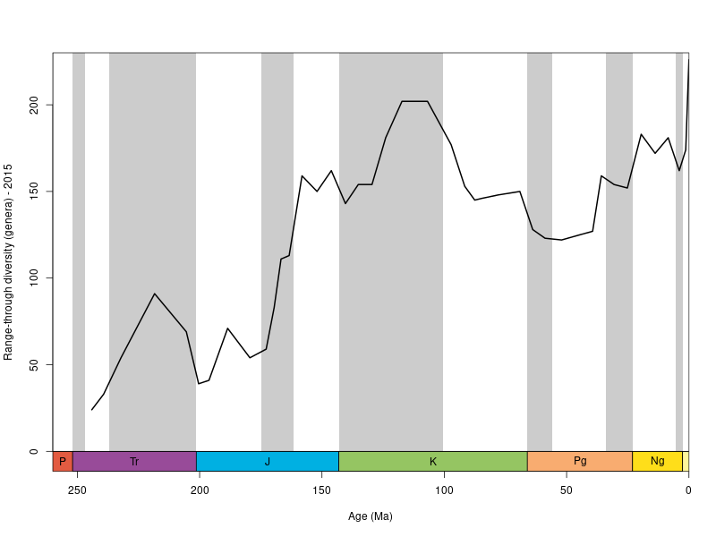

# divDyn: Diversity Dynamics 

[](https://github.com/divDyn/r-package)
[](https://cran.r-project.org/package=divDyn)
[](https://cran.r-project.org/package=divDyn)
[](https://cran.r-project.org/web/checks/check_results_divDyn.html)
[](https://doi.org/10.5281/zenodo.7056783)

### Diversity Dynamics using fossil occurrence data

Functions to describe sampling and diversity dynamics of fossil
occurrence datasets (e.g. from the Paleobiology Database). The package
includes methods to calculate range- and occurrence-based metrics of
taxonomic richness, extinction and origination rates, along with
traditional sampling measures. A powerful subsampling tool is also
included that implements frequently used sampling standardization
methods in a multiple bin-framework. The plotting of time series and the
occurrence data can be simplified by the functions incorporated in the
package, as well as other calculations, such as environmental affinities
and extinction selectivity testing. Details can be found in: Kocsis,
A.T.; Reddin, C.J.; Alroy, J. and Kiessling, W. (2019)
<doi:10.1101/423780>.

<br>

## Site Contents

------------------------------------------------------------------------

The site is getting filled with the following content:

#### Tutorials with the PBDB coral data from 2015

- This particular dataset is used to ensure interface stability and
  consistency.

#### The ‘ddPhanero’ analysis (from the MiEE paper)

- Execute up-to-date versions

#### Function reference and technical material

#### Additional material

- How-to guides on combining the package’s capabilities with other
  packages are deposited on the [evolvED
  blog](https://www.evolv-ed.net/).

<br>

## Example output

------------------------------------------------------------------------

``` r
# attach library
  library(divDyn)

# import example data
  data(corals)
  data(stages)

# calculate metrics of diversity dynamics
   dd <- divDyn(corals, tax="genus", bin="stg")

# plotting
  tsplot(stages, shading="series", boxes="sys", xlim=c(260,0), 
    ylab="Range-through diversity (genera) - 2015", ylim=c(0,230),
    boxes.col="systemCol")
  lines(stages$mid, dd$divRT, lwd=2)
```



<br>

## Plans

------------------------------------------------------------------------

#### Near

- Splitting up vignettes to separate **Tutorials**
- Adding the ddPhanero case study with updates
- Package updates

#### Distant

- Writing a C++ library from the core functionality and porting it to
  Python and Julia


